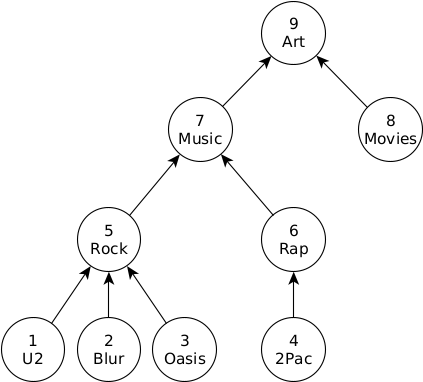
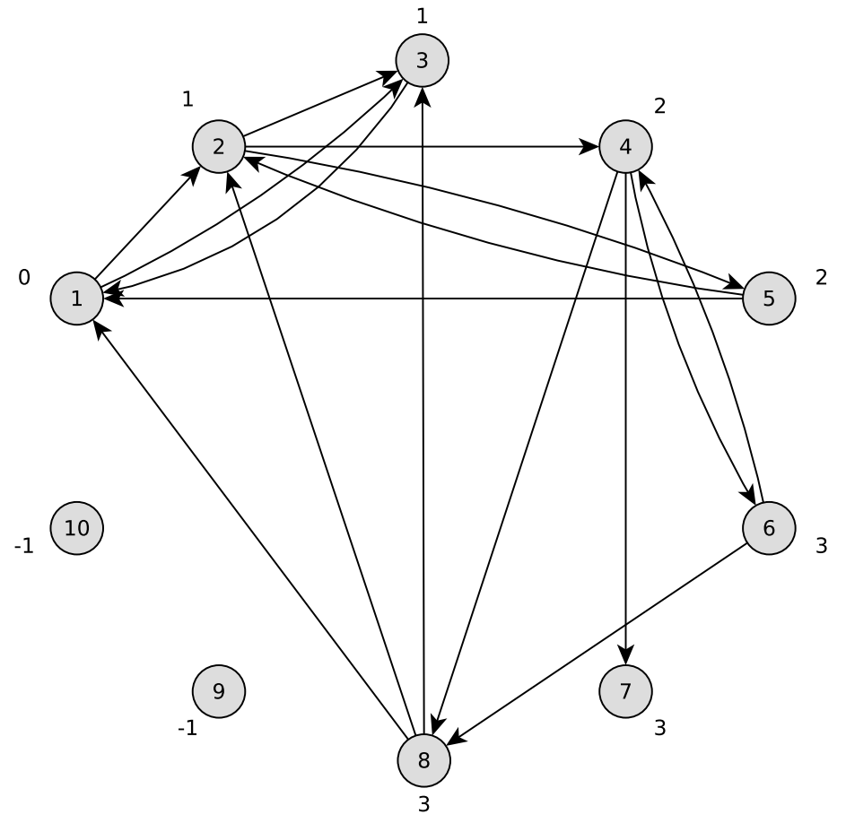

The `WITH` clause allows you to specify common table expressions (CTEs). Regular (non-recursive) common-table-expressions are essentially views that are limited in scope to a particular query. CTEs can reference each-other and can be nested.

### Basic CTE examples

```sql
-- create a CTE called "cte" and use it in the main query
WITH cte AS (SELECT 42 AS x)
SELECT * FROM cte;
```
```
┌────┐
│ x  │
├────┤
│ 42 │
└────┘
```
```sql
-- create two CTEs, where the second CTE references the first CTE
WITH cte AS (SELECT 42 AS i),
     cte2 AS (SELECT i*100 AS x FROM cte)
SELECT * FROM cte2;
```
```
┌──────┐
│  x   │
├──────┤
│ 4200 │
└──────┘
```

### Recursive CTE examples

#### Tree traversal

`WITH RECURSIVE` can be used to traverse trees. For example, take a hiearchy of tags:



```sql
CREATE TABLE tag(id int, name varchar, subclassof int);
INSERT INTO tag VALUES
 (1, 'U2',     5),
 (2, 'Blur',   5),
 (3, 'Oasis',  5),
 (4, '2Pac',   6),
 (5, 'Rock',   7),
 (6, 'Rap',    7),
 (7, 'Music',  9),
 (8, 'Movies', 9),
 (9, 'Art', NULL);
```

The following query returns the path from the node `Oasis` to the root of the tree (`Art`).

```sql
WITH RECURSIVE tag_hierarchy(id, source, path) AS (
  SELECT id, name, [name] AS path
  FROM tag
  WHERE subclassof IS NULL
UNION ALL
  SELECT tag.id, tag.name, list_prepend(tag.name, tag_hierarchy.path)
  FROM tag, tag_hierarchy
  WHERE tag.subclassof = tag_hierarchy.id
)
SELECT path
FROM tag_hierarchy
WHERE source = 'Oasis';
```
```
┌───────────────────────────┐
│           path            │
├───────────────────────────┤
│ [Oasis, Rock, Music, Art] │
└───────────────────────────┘
```

#### Graph traversal

The `WITH RECURSIVE` clause can be used to express graph traversal on arbitrary graphs. However, if the graph has cycles, the query must perform cycle detection to prevent infinite loops.

Take the following undirected social graph:



```sql
CREATE TABLE knows(person1id int, person2id int);
INSERT INTO knows VALUES (1, 2), (1, 4), (2, 3), (2, 4), (3, 4), (5, 6);
INSERT INTO knows SELECT person2id, person1id FROM knows;
```

Note that there is a cycle e.g. between nodes 1, 2, and 4. To detect cycles, the query stores the path in a [list](/docs/sql/data_types/list) and, before adding a new edge, checks whether its endpoint has been visited before.

The following query returns all paths from person 1:

```sql
WITH RECURSIVE paths(startPerson, endPerson, path) AS (
   SELECT -- define the path as the first edge of the traversal
        person1id AS startPerson,
        person2id AS endPerson,
        [person1id, person2id] AS path
     FROM knows
   UNION ALL
   SELECT -- concatenate new edge to the path
        paths.startPerson AS startPerson,
        person2id AS endPerson,
        array_append(path, person2id) AS path
     FROM paths
     JOIN knows ON paths.endPerson = knows.person1id
    WHERE knows.person2id != ALL(paths.path) -- detect cycles
)
SELECT startPerson, endPerson, path
FROM paths
WHERE startPerson = 1;
```
```
┌─────────────┬───────────┬──────────────┐
│ startPerson │ endPerson │     path     │
├─────────────┼───────────┼──────────────┤
│ 1           │ 2         │ [1, 2]       │
│ 1           │ 4         │ [1, 4]       │
│ 1           │ 3         │ [1, 4, 3]    │
│ 1           │ 4         │ [1, 2, 4]    │
│ 1           │ 2         │ [1, 4, 2]    │
│ 1           │ 3         │ [1, 2, 3]    │
│ 1           │ 2         │ [1, 4, 3, 2] │
│ 1           │ 3         │ [1, 2, 4, 3] │
│ 1           │ 4         │ [1, 2, 3, 4] │
│ 1           │ 3         │ [1, 4, 2, 3] │
└─────────────┴───────────┴──────────────┘
```

`WITH RECURSIVE` can be used to find all unweighted shortest paths between two nodes. The following query returns all unweighted shortest paths between person 1 and person 3:

```sql
WITH RECURSIVE paths(startPerson, endPerson, path, endReached) AS (
   SELECT person1id AS startPerson,
          person2id AS endPerson,
          [person1id, person2id] AS path,
          max(CASE WHEN person2id = 3 THEN true ELSE false END)
            OVER (ROWS BETWEEN UNBOUNDED PRECEDING
                           AND UNBOUNDED FOLLOWING) AS endReached
     FROM knows
    WHERE person1id = 1
 UNION ALL
   SELECT paths.startPerson AS startPerson,
          person2id AS endPerson,
          array_append(path, person2id) AS path,
          max(CASE WHEN person2id = 3 THEN true ELSE false END)
            OVER (ROWS BETWEEN UNBOUNDED PRECEDING
                           AND UNBOUNDED FOLLOWING) AS endReached
     FROM paths
     JOIN knows
       ON person1id = paths.endPerson
    WHERE person2id != ALL(paths.path)
      AND NOT paths.endReached
)
SELECT startPerson, endPerson, path
FROM paths
WHERE endPerson = 3;
```
```
┌─────────────┬───────────┬───────────┐
│ startPerson │ endPerson │   path    │
├─────────────┼───────────┼───────────┤
│ 1           │ 3         │ [1, 4, 3] │
│ 1           │ 3         │ [1, 2, 3] │
└─────────────┴───────────┴───────────┘
```

## Common Table Expressions
<div id="rrdiagram"></div>
